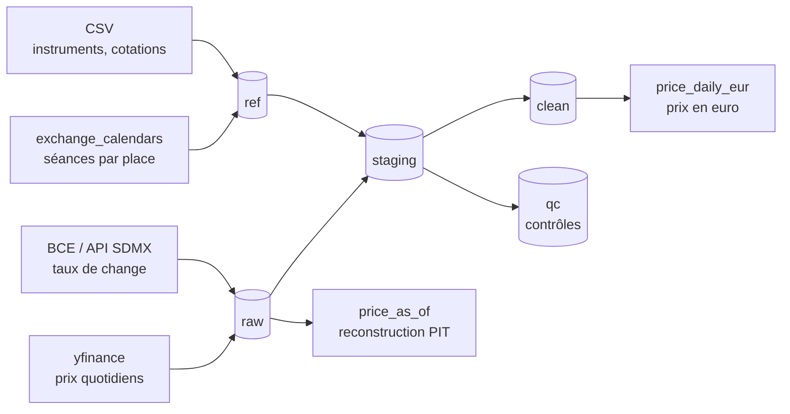

# Pipeline de données de marché — actions européennes

Pipeline ETL en Python et PostgreSQL qui ingère, réconcilie et sert des
données de marché sur un univers d'actions européennes, avec correction
point-in-time et contrôles qualité automatisés.

L'objectif n'est pas de produire un notebook de plus, mais de montrer ce
que demande la mise en production d'un jeu de données : identifier les
pièges avant qu'ils n'atteignent le consommateur, rendre les anomalies
visibles plutôt que silencieuses, et pouvoir répondre à la question
« que savait-on à cette date ? ».

---

## En bref

| | |
|---|---|
| Univers | 15 actions européennes (EURO STOXX 50, FTSE 100, SMI) |
| Places | XPAR, XETR, XAMS, XMIL, XMAD, XLON, XSWX |
| Période | 2015 → aujourd'hui |
| Volume | ~44 500 barres quotidiennes, ~9 000 taux de change |
| Sources | yfinance (prix), BCE via API SDMX (taux de change) |
| Stack | Python, PostgreSQL 16, Docker |

---

## Démarrage

Prérequis : Docker et Python 3.11+.

```bash
cp .env.example .env          # puis renseigner un mot de passe
docker compose up -d          # PostgreSQL + création des schémas
python -m venv .venv && source .venv/bin/activate
pip install -r requirements.txt

python src/ingest_prices.py    # prix quotidiens
python src/load_reference.py   # référentiel instruments et cotations
python src/ingest_fx.py        # taux de change BCE
python src/load_calendar.py    # calendriers d'échange
python src/run_quality_checks.py
```

Le dernier script renvoie un code de sortie non nul si un contrôle
bloquant échoue, ce qui permet de le brancher sur une intégration
continue.

---

## Architecture



Quatre couches, avec une responsabilité chacune.

**`raw`** — append-only, jamais modifiée, jamais purgée. C'est le témoin
fidèle de ce que le fournisseur a envoyé. Toute correction ultérieure de
sa part crée une nouvelle ligne à côté de l'ancienne.

**`ref`** — le référentiel : instruments identifiés par ISIN, cotations
par place, devises et sous-unités. Contrairement à `raw`, ces tables se
corrigent et s'enrichissent.

**`staging`** — la donnée rendue exploitable : dernière révision connue,
rattachement à l'ISIN, normalisation des devises, conversion en euro.

**`qc`** — les contrôles, et la quarantaine des lignes écartées avec
leur motif.

---

## Ce que le pipeline garantit

### Idempotence

Rejouer une ingestion n'insère aucun doublon. La garantie est portée par
une contrainte `UNIQUE` en base, pas par du code Python : elle tient même
si quelqu'un insère par un autre chemin.

```sql
UNIQUE (source, vendor_symbol, event_date, payload_hash)
```

Le `payload_hash` est une empreinte des valeurs numériques. Deux
conséquences d'un seul mécanisme :

- valeurs identiques → même hash → doublon refusé, l'ingestion est rejouable ;
- valeurs corrigées par le fournisseur → hash différent → nouvelle ligne
  acceptée, **la révision est capturée automatiquement**.

C'est ce qui rend le point-in-time possible sans effort de
synchronisation supplémentaire. Un cas réel est documenté plus bas.

### Correction point-in-time

Chaque enregistrement porte trois horodatages distincts :

| Colonne | Question à laquelle elle répond |
|---|---|
| `event_date` | à quel jour la donnée se rapporte-t-elle ? |
| `available_at` | à partir de quand était-elle **connaissable** ? |
| `ingested_at` | quand l'avons-nous effectivement chargée ? |

La fonction `staging.price_as_of()` reconstruit l'état des connaissances
à un instant donné :

```sql
SELECT count(*), max(event_date)
FROM staging.price_as_of('2020-03-15 09:00:00+01');
--  19828 | 2020-03-13
```

Au 15 mars 2020 à 9h, la dernière séance connaissable est le vendredi 13.
Les cotations du lundi 16 n'existaient pas encore. Le look-ahead bias est
traité à la racine, dans le modèle de données, plutôt que par des
précautions dans le code d'analyse.

Un second paramètre distingue deux questions différentes :

- `price_as_of(t)` — ce qui était **publiquement connaissable** à `t`.
  C'est la question du chercheur qui rejoue une stratégie.
- `price_as_of(t, true)` — ce que **notre base contenait** à `t`,
  retards de chargement compris. C'est la question de l'audit.

La distinction vient d'un constat concret : l'historique de ce projet a
été rechargé après coup, pas accumulé au fil de l'eau. Filtrer sur
`ingested_at` renvoyait donc zéro ligne pour toute date antérieure à la
création de la base — un résultat correct mais inutilisable.

### La logique métier encodée en données

Le facteur de conversion GBp → GBP est une ligne de `ref.currency`, pas
un `if` dans le code :

| code | major_code | factor_to_major |
|---|---|---|
| GBp | GBP | 0.01 |
| CHF | CHF | 1 |

Ajouter une devise ou corriger une règle ne demande aucune modification
de code, et la règle est auditable par lecture de la table.

### Les absences sont bruyantes

Une donnée manquante ne laisse aucune trace : c'est le mode de
défaillance le plus dangereux. Le pipeline est construit pour rendre
chaque absence visible.

- `staging.unmapped_symbols` — symboles présents dans `raw` mais absents
  du référentiel, qui disparaîtraient sinon d'une jointure interne.
- `staging.missing_fx` — lignes sans taux de change applicable.
- `qc.missing_sessions` — séances attendues d'après le calendrier de la
  place mais absentes des données.
- `fx_age_days` — ancienneté du taux de change appliqué, pour que le
  report d'un taux antérieur soit visible et non masqué.

Le choix d'un `LEFT JOIN LATERAL` plutôt qu'une jointure interne pour la
conversion de devise relève de ce principe : lors du développement, les
quatre valeurs britanniques et suisses sont apparues avec des cases vides
au lieu de disparaître silencieusement du résultat.

---

## Constats réels sur les données

Ces anomalies ont toutes été découvertes par les contrôles du pipeline,
sur des données réelles. Elles sont datées et reproductibles.

### Londres cote en pence, pas en livres

Au 27 août 2026, AZN.L affichait **12114**. AstraZeneca ne valait pas
vingt-sept fois LVMH : 12114 pence font 121,14 GBP.

Sans normalisation, tout classement par prix, toute pondération de
portefeuille et tout calcul de capitalisation sont faux d'un facteur 100.
Et rien ne plante : le calcul aboutit et produit un nombre plausible.

### Le fournisseur fabrique des séances qui n'existent pas

21 lignes correspondent à des jours où la place était fermée : Noël 2015
et 2019, le lundi de Pentecôte 2017 et 2018, la fête de l'Unité allemande,
le jour de la Réforme 2017 (férié exceptionnel cette année-là en Allemagne).

Le motif est toujours le même — `open = high = low = close` et
`volume = 0`. Quand la bourse est fermée, yfinance recopie la clôture
précédente au lieu de ne rien renvoyer.

Ce seul défaut expliquait trois contrôles à la fois : séances
inattendues, prix figés, et une partie des incohérences OHLC. Ces lignes
sont détectables uniquement par comparaison à un calendrier d'échange
externe.

### Les calendriers ne coïncident pas entre fournisseurs

14 lignes, toutes britanniques, toutes un 1er mai : 2015, 2018, 2019,
2020, 2024, 2025, 2026. Ce sont les années où le 1er mai tombait entre le
mardi et le vendredi.

Le LSE cotait ces jours-là, mais la BCE suit le calendrier TARGET, qui
ferme le 1er mai. Le pipeline applique alors le dernier taux connu — celui
du 30 avril — et l'expose via `fx_age_days = 1`.

Le report ne peut jamais dépasser un jour, et la raison mérite d'être
notée : le week-end ne produit aucun décalage, puisque ni la bourse ni la
BCE ne travaillent le samedi. Seul un jour férié asymétrique entre les
deux calendriers crée un écart.

### Une révision de fournisseur, capturée sans intervention

Le 1er septembre 2026, l'ingestion nocturne a récupéré deux valeurs
londoniennes dans un état provisoire. Trois jours plus tard, la même
commande a rechargé les valeurs consolidées.

| symbole | open | close | volume | ingested_at |
|---|---|---|---|---|
| AZN.L | 0 | 11962 | 1 239 | 2026-09-02 00:14 |
| AZN.L | 11650 | 11962 | 2 914 975 | 2026-09-05 00:52 |
| SHEL.L | 0 | 3432.5 | 5 420 | 2026-09-02 00:14 |
| SHEL.L | 3399.5 | 3432.5 | 17 710 332 | 2026-09-05 00:52 |

Les deux versions coexistent dans `raw.price_daily` : la contrainte
d'unicité inclut le hash des valeurs, donc une correction du fournisseur
produit une nouvelle ligne au lieu d'écraser l'ancienne. Aucun code
particulier n'a été nécessaire — le mécanisme d'idempotence et le
mécanisme de capture des révisions sont le même.

Le point notable est ailleurs : **la clôture était déjà correcte dans la
version provisoire.** Seuls l'ouverture, à zéro, et le volume révélaient
le problème — 1 239 titres échangés contre 2 914 975 en réalité, soit
0,04 % du volume réel. Un contrôle qui n'aurait examiné que le prix de
clôture aurait accepté ces lignes, et tout calcul pondéré par les volumes
en aurait été faussé.

C'est l'argument concret en faveur de la couche `raw` immuable : la
version provisoire reste consultable, l'écart entre les deux est
mesurable, et `price_as_of()` permet de rejouer une analyse telle qu'elle
aurait été produite le 2 septembre.

### Le nombre de séances diffère par place

Sur 2015–2026 : Paris 2983, Francfort et Milan 2962, Londres 2945,
Zurich 2929. Les écarts sont dus aux jours fériés nationaux.

Les valeurs suisses démarrent au 5 janvier 2015 et non au 2 : le
Berchtoldstag est férié en Suisse.

Un contrôle de trous comparé au mauvais calendrier produirait des
centaines de fausses alertes.

### Le type exact en base ne répare pas ce qui arrive approximatif

yfinance renvoie `203.399994` pour 203,40 et `445.200012` pour 445,20.
Ce sont des artefacts de virgule flottante simple précision, présents
dans la donnée avant qu'elle n'atteigne PostgreSQL.

Le choix du type `NUMERIC` garantit l'exactitude des calculs en base mais
ne corrige pas l'amont. Le nettoyage est fait par arrondi documenté dans
la couche `staging`.

### Les sauts de prix violents sont des événements réels

ISP.MI à −22,9 % le 24 juin 2016, lendemain du référendum sur le Brexit.
AIR.PA à −22,2 % le 18 mars 2020, krach Covid. SAP.DE à −21,9 % le
26 octobre 2020, avertissement sur résultats.

Aucun n'est une erreur de données. C'est précisément pourquoi ce contrôle
est classé « à vérifier » et non « bloquant » : un rejet automatique
supprimerait les séances les plus intéressantes de l'historique.

---

## Contrôles qualité

Trois niveaux, et la distinction est une décision d'exploitation, pas une
nuance de vocabulaire.

| Niveau | Signification | Effet |
|---|---|---|
| **BLOQUANT** | la donnée servie est fausse | code de sortie non nul, la CI échoue |
| **À VÉRIFIER** | signal ambigu, arbitrage humain nécessaire | signalé, non bloquant |
| **OBSERVÉ** | cause connue, déjà traitée en amont | suivi pour détecter une dérive |

Les contrôles bloquants portent sur `staging.price_daily_clean`, la couche
servie aux consommateurs, qui doit être irréprochable. Les anomalies
connues restent visibles dans la quarantaine, comptées et motivées, mais
ne font plus échouer le pipeline.

Un système qui alerte sur tout finit ignoré : c'est le mode de
défaillance le plus courant en production.

**Contrôles implémentés** : cohérence OHLC, prix nuls ou négatifs,
séances manquantes par rapport au calendrier de la place, séances hors
calendrier, prix figés sur trois séances consécutives, sauts supérieurs à
20 %, symboles non rattachés au référentiel, absence de taux de change,
fraîcheur des données.

**Quarantaine** — les lignes écartées ne sont jamais supprimées. Elles
sont exposées par `qc.excluded_rows` avec leur motif, et la couche `clean`
est une vue : changer d'avis sur une règle ne demande aucune
réingestion.

État actuel : 44 517 lignes conservées sur 44 544, soit 99,94 %.

| Motif d'exclusion | Lignes |
|---|---|
| hors calendrier de la place | 21 |
| barre OHLC incohérente | 6 |

Le motif « prix nul ou négatif » comptait 2 lignes avant que le
fournisseur ne consolide la séance du 1er septembre 2026. Il est
aujourd'hui vide, et la quarantaine sert précisément à observer ce genre
de résorption.

---

## Ajouter une source

La contrainte opérationnelle centrale est le time-to-production : combien
de temps entre « le desk demande ce jeu de données » et « il est
disponible en production ». L'architecture est organisée pour que ce coût
reste faible.

Ajouter un fournisseur de prix demande trois choses :

1. **Un adapter** dans `src/`, sur le modèle de `ingest_prices.py` ou
   `ingest_fx.py` : récupérer, calculer le `payload_hash`, déterminer
   l'`available_at`, insérer avec `ON CONFLICT DO NOTHING`.
2. **Des lignes dans `data/listings.csv`** rattachant les symboles du
   nouveau fournisseur aux ISIN existants.
3. **Rien d'autre.** Les contrôles qualité, la conversion de devise et la
   requête `as_of` fonctionnent sans modification, puisqu'ils opèrent sur
   l'ISIN et non sur le symbole du fournisseur.

C'est la raison d'être de la séparation instrument / cotation / place :
Airbus cote à Paris, Francfort et Madrid sous un même ISIN. Un modèle
fondé sur le ticker aurait exigé de tout retoucher.

---

## Runbook

**« La source n'a pas livré ce matin »**

```bash
python src/run_quality_checks.py       # section Fraîcheur
```

Comparer `days_since_last_session` au calendrier de la place. Un retard de
1 à 3 jours peut être un week-end ou un jour férié. Consulter
`raw.ingestion_log` pour savoir si le chargement a tourné et avec quel
résultat.

Relancer l'ingestion est sans risque : elle est idempotente.

**« Un prix a l'air faux »**

```sql
SELECT * FROM qc.row_quality
WHERE vendor_symbol = 'XXX' AND event_date = 'YYYY-MM-DD';
```

La colonne `quality_flag` indique si la ligne a été écartée et pourquoi.
`close_vendor` et `currency_vendor` conservent la valeur d'origine du
fournisseur, avant normalisation.

Pour savoir si le fournisseur a révisé cette ligne, interroger `raw` sans
déduplication : plusieurs `ingested_at` pour un même `event_date`
signalent une correction.

**« Les taux de change semblent périmés »**

`staging.fx_rate_daily` est une vue matérialisée : c'est un instantané
qui ne se met pas à jour seul.

```sql
REFRESH MATERIALIZED VIEW staging.fx_rate_daily;
```

---

## Limites connues

Elles sont listées ici parce qu'un projet de données sans limites connues
est un projet dont les limites n'ont pas été cherchées.

**yfinance n'est pas une API officielle.** Non documentée, sujette au
rate limiting, susceptible de casser sans préavis. Retenue pour sa
couverture européenne gratuite. La BCE illustre par contraste ce
qu'apporte un fournisseur officiel : structure stable, heure de
publication connue, révisions annoncées.

**Biais du survivant.** L'univers est figé sur la composition actuelle
des indices. Les sociétés sorties de cote sur la période sont absentes,
ce qui biaise à la hausse toute étude de performance. Corriger cela
demanderait un historique de composition d'indice, généralement payant.

**Le référentiel est alimenté par des CSV maintenus à la main.** Les ISIN
ont été vérifiés individuellement auprès des places de cotation et des
pages investisseurs des émetteurs, et la base impose un contrôle de
format. Mais rien ne garantit qu'une saisie future soit correcte : un
ISIN valide en forme peut désigner le mauvais titre. En production, cette
donnée viendrait d'un fournisseur de référentiel avec réconciliation
automatique, pas d'un fichier édité manuellement.

**`available_at` des prix est une approximation** — 22h00 UTC, après la
clôture de toutes les places européennes. Les vrais horaires de clôture
par place affineraient la reconstruction point-in-time intrajournalière.
La révision du 1er septembre 2026 documentée plus haut montre d'ailleurs
qu'une ingestion nocturne peut attraper une séance non encore consolidée :
l'heure de disponibilité réelle est plus tardive que celle retenue.

**Les migrations SQL sont appliquées manuellement.** Un outil comme
Flyway ou Alembic suivrait quelles migrations ont déjà tourné et
éviterait de dépendre de l'ordre d'exécution.

**La vue matérialisée des taux doit être rafraîchie à la main** après
chaque ingestion. Arbitrage assumé entre fraîcheur et performance :
laissée en vue simple, elle rendait la jointure `LATERAL` inutilisable —
45 000 lignes de prix multipliées par 9 000 taux recalculés à chaque
requête.

---

## Évolutions prévues

- Réconciliation entre deux fournisseurs de prix sur un même instrument,
  avec seuil d'écart et alerte
- Donnée alternative : pageviews Wikipedia, avec le travail de mapping
  entité → ISIN qu'elle implique
- Couche de service `get(univers, champs, début, fin, as_of)` renvoyant
  un DataFrame prêt à l'emploi pour la recherche
- Intégration continue GitHub Actions exécutant les contrôles qualité
- Prototypage : évaluer si une source alternative apporte de
  l'information exploitable, avec validation walk-forward, baseline naïve
  et coûts de transaction

---

## Structure du dépôt

```
.
├── docker-compose.yml        PostgreSQL 16
├── requirements.txt
├── sql/
│   ├── 001_schema.sql        couche raw, append-only
│   ├── 002_reference.sql     instruments, cotations, devises
│   ├── 003_staging.sql       déduplication des révisions, normalisation
│   ├── 004_fx.sql            taux de change, conversion euro
│   ├── 005_materialize.sql   vue matérialisée et index
│   ├── 006_calendar_qc.sql   calendriers, contrôles, fonction as_of
│   ├── 007_as_of.sql         as_of à deux modes
│   └── 008_clean.sql         quarantaine et couche propre
├── src/
│   ├── db.py                 connexion
│   ├── ingest_prices.py      adapter yfinance
│   ├── ingest_fx.py          adapter BCE
│   ├── load_reference.py     chargement du référentiel
│   ├── load_calendar.py      calendriers d'échange
│   └── run_quality_checks.py rapport qualité, code de sortie CI
├── data/
│   ├── universe.csv
│   ├── instruments.csv       ISIN, nom, pays
│   └── listings.csv          ISIN ↔ symbole fournisseur, place, devise
└── JOURNAL.md                journal de développement et observations
```

---

## Notes

Les données de marché proviennent de Yahoo Finance via yfinance et de la
Banque centrale européenne. Ce dépôt est un projet personnel à but
pédagogique et de démonstration ; il ne constitue ni un conseil en
investissement ni un produit destiné à un usage en production.
